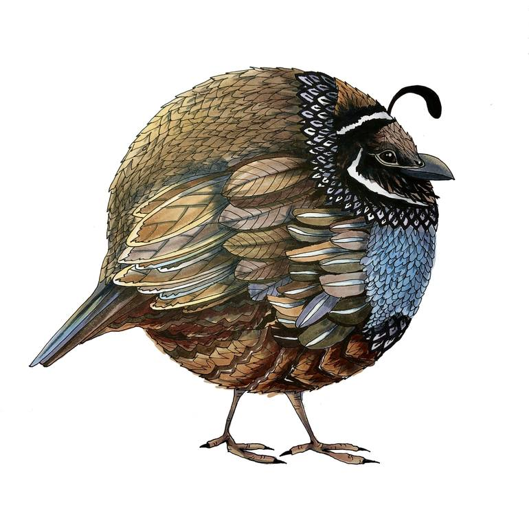
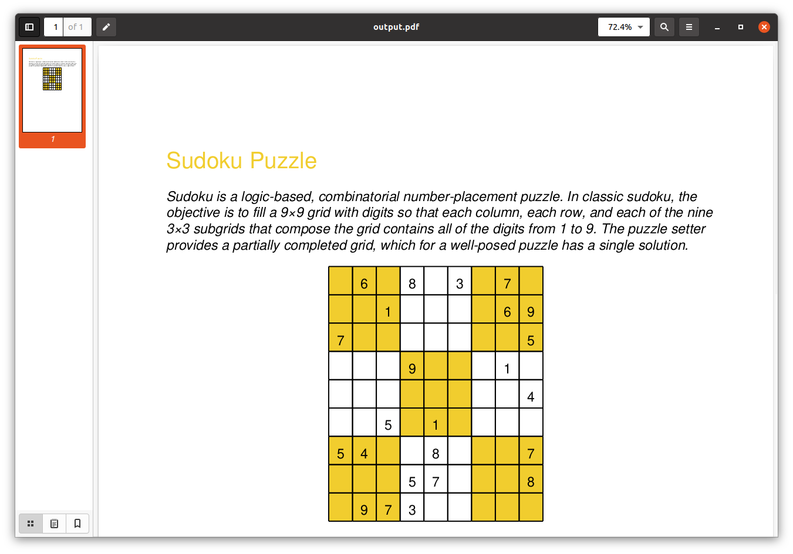

# 9 Showcases

In this chapter we'll build some practical PDF documents that are ready-to-use.
This chapter assumes you have a good working knowledge of all the basic `LayoutElement`  concepts.



<div style="page-break-before: always;"></div>

## 9.1 Building a sudoku puzzle

First let's define the representation of the sudoku.
This code does not need to be very high-performant, or solve a sudoku.
So for this example, representing a sudoku as a `str` will do fine.

```python
#!src/snippet_001.py
```

Next we're going to build a `Document` containing the basic information.

```python
#!src/snippet_002.py
```

We can render the sudoku in a `Document` by using a `FlexibleColumnWidthTable`

```python
#!src/snippet_003.py
```

Finally, we can store the `Document`

```python
#!src/snippet_004.py
```

That should yield a wonderful little puzzle in a PDF, like so:



## 9.2 Building a realistic invoice

```python
#!src/snippet_005.py
```

Since we don't want to deal with calculating coordinates - we can delegate this to a `PageLayout` which manages all of the content and its positions:

```python
#!src/snippet_006.py
```

Here, we're using a `SingleColumnLayout` since all of the content should be in a single column - we won't have a left and right side of the invoice. 
We're also making the vertical margin smaller here. The default value is to trim the top 10% of the page height as the margin, and we're reducing it down to 2%, since we'll want to use this space for the company logo/name.

Speaking of which, let's add the company logo to the layout:

```python
#!src/snippet_007.py
```

Here, we're adding an element to the layout - an `Image`. Through its constructor, we're adding a URL pointing to the image resource and setting its `width` and `height`.

Beneath the image, we'll want to add our imaginary company info (name, address, website, phone) as well as the invoice information (invoice number, date, due date).

A common format for brevity (which incidentally also makes the code cleaner) is to use a table to store invoice data. Let's create a separate helper method to build the invoice information in a table, which we can then use to simply add a table to the invoice in our main method:

```python
#!src/snippet_008.py
```

Here, we're making a simple `Table` with 5 rows and 3 columns. The rows correspond to the street address, city/state, phone, email address and company website. Each row will have `0..3` values (columns). Each text element is added as a `Paragraph`, which we've aligned to the right via `Alignment.RIGHT`, and accept styling arguments such as font.

Finally, we've added padding to all the cells to make sure we don't place the text awkwardly near the confounds of the cells.

Now, back in our main method, we can call `_build_invoice_information()` to populate a table and add it to our layout:

```python
#!src/snippet_009.py
```

Great! Now we'll want to add the billing and shipping information as well. It'll conveniently be placed in a table, just like the company information. For brevity's sake, we'll also opt to make a separate helper function to build this info, and then we can simply add it in our main method:

```python
#!src/snippet_010.py
```

Let's call this in the main method as well:

```python
#!src/snippet_011.py
```

With our basic information sorted out (company info and billing/shipping info) - we'll want to add an itemized description. These will be the goods/services that our supposed company offered to someone and are also typically done in a table-like fashion beneath the information we've already added.

Again, let's create a helper function that generates a table and populates it with data, which we can simply add to our layout later on.

We'll start by defining a Product class to represent a sold product. In practice, you'd substitute the hard-coded strings related to the subtotal, taxes and total prices with calculations of the actual prices - though, this heavily depends on the underlying implementation of your Product models, so we've added a stand-in for abstraction.

```python
#!src/snippet_012.py
```

Now we can build a method `_build_itemized_description_table` that will render these products and their prices to the PDF:

```python
#!src/snippet_013.py
```

Let's call this method with some dummy `Product` items:

```python
#!src/snippet_014.py
```

Finally, you can store the PDF to disk

```python
#!src/snippet_015.py
```

The final PDF should look somewhat like this:


## 9.3 Creating a stunning flyer

These are the steps to creating a PDF document using borb:

- Create an empty `Document`
- Create an empty `Page`
- Append the `Page` to the `Document`
- Set a `PageLayout` to handle the flow of content (we're using a `SingleColumnLayout` here)
- Add content (not shown here)
- Write the PDF to disk (not shown here)

```python
#!src/snippet_016.py
```

We'd like to add some geometric artwork to our flyer in the upper right corner. We're going to write a separate method to do that. Then we can later re-use this method (for instance on every `Page` in the `Document`).

```python
#!src/snippet_017.py
```

Now that we've defined this method, we can call it in the main body of our script to add the artwork to the PDF.

```python
#!src/snippet_018.py
```

Next we're going to add our company contact details, so people know where to reach us:

```python
#!src/snippet_019.py
```

Now we can add a few titles and subtitles and some promotional blurb;

```python
#!src/snippet_020.py
```

Images make things more visually interesting. Let's add an `Image` with some core product features next to it;

```python
#!src/snippet_021.py
```

Let's add a footer to the bottom of the page. We're going to put this in a separate method (so that we could call it later on, if we ever need to apply it to other pages in the PDF).

```python
#!src/snippet_022.py
```

Now we can call this method in the main body;

```python
#!src/snippet_023.py
```

The final PDF should look somewhat like this:


## 9.4 Conclusion

This section was all about wrapping up your knowledge with some practical examples.
I hope you enjoyed working through the examples.